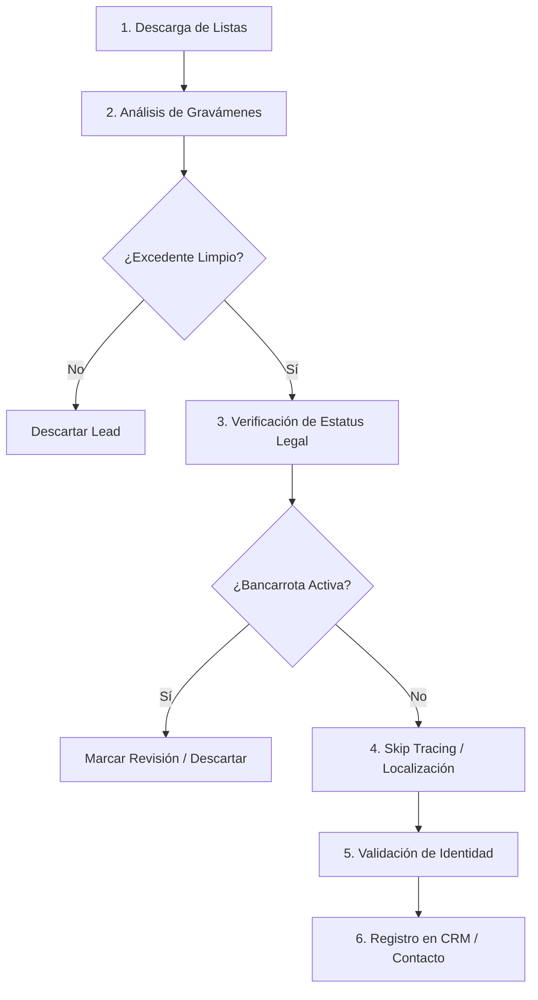

# Guía y Arquitectura de Automatización: OSINT para Recuperación de Surplus Funds

Esta guía detalla la metodología, herramientas y arquitectura de automatización para el negocio de **Recuperación de Fondos Excedentes (Surplus Funds / Overages)** utilizando inteligencia de fuentes abiertas (OSINT) y APIs especializadas.

---

## 1. ¿Qué son los Surplus Funds?

Los **surplus funds** (fondos excedentes), también llamados *overages* o *excess proceeds*, son el dinero sobrante después de que una propiedad es vendida en una subasta judicial (por ejecución hipotecaria o impago de impuestos - *foreclosure* o *tax deed sale*). 

Si el precio final de venta supera la deuda total acumulada con el banco o el condado, el dinero excedente pertenece legalmente al dueño original de la propiedad (o a sus herederos). Si no se reclama dentro del plazo límite del estado (generalmente entre 1 y 3 años), los fondos se pierden (*escheat*) a favor del estado.

---

## 2. Flujo de Trabajo OSINT para Surplus Funds

Para automatizar este modelo de negocio a gran escala, el sistema sigue este flujo de trabajo sistemático:

### Paso 1: Descubrimiento y Descarga de Listas de Excedentes
Los condados y tribunales de EE.UU. publican periódicamente listas de dinero no reclamado. Mediante **Google Dorking** es posible localizar estas listas en servidores gubernamentales (`.gov` o `.us`):

*   **Dork para listas de Excel/PDF:** 
    `site:.gov "surplus list" OR "excess proceeds" OR "unclaimed funds" filetype:xls OR filetype:xlsx OR filetype:pdf`
*   **Dork específico por estado (ej. Florida):** 
    `site:*.fl.us "surplus" OR "tax deed sale" filetype:pdf`

### Paso 2: Análisis de Gravámenes (Liens)
Antes de contactar a un cliente, se debe comprobar si hay deudas que se cobrarán primero de ese dinero sobrante.
*   **Fuentes:** County Recorder of Deeds / Property Appraiser del condado.
*   **Búsqueda:** Segundas hipotecas (*deeds of trust*), gravámenes del IRS (*federal tax liens*), deudas de asociaciones de vecinos (*HOA liens*) o sentencias judiciales civiles (*judgments*).
*   **Fórmula:** `Monto Excedente - Suma de Gravámenes Secundarios = Margen Reclamable Real`.

### Paso 3: Verificación de Bancarrota
*   **Importancia:** Si el antiguo dueño está en bancarrota, los fondos pertenecen legalmente a la corte de bancarrota (al *bankruptcy trustee*). Contactar y cobrar comisión directamente al deudor sin autorización judicial es ilegal.
*   **Herramienta:** Consulta de registros en tribunales federales (PACER o servicios agregados).

### Paso 4: Localización del Propietario (Skip Tracing)
Dado que el dueño ya no vive en la propiedad subastada, se utilizan bases de datos públicas de registros históricos de direcciones y telefonía para encontrar su ubicación actual.
*   **Herramientas gratuitas/bajo coste:** TruePeopleSearch, FastPeopleSearch, CyberBackgroundChecks.
*   **Genealogía forense (si el dueño falleció):** Obituarios en Legacy.com o FindAGrave para identificar descendientes directos, complementado con búsquedas en el tribunal testamentario (*Probate Court*).

---

## 3. Integración y Automatización mediante APIs

Para transformar este proceso manual en una operación de software automatizada, el sistema requiere integración con las siguientes APIs clave:

| Categoría | API Sugerida | Qué aporta al sistema |
| :--- | :--- | :--- |
| **Registros Inmobiliarios y Liens** | **ATTOM Data API / Estated / PropStream** | Agrega datos de gravámenes e hipotecas de todo EE.UU., permitiendo calcular el excedente limpio automáticamente. |
| **Búsqueda del Mercado Inmobiliario** | **Spark API (FlexMLS) / Zillow API** | Comparables de mercado, estado de ocupación, listados de venta históricos y fotos de la propiedad. |
| **Skip Tracing (Localización)** | **BatchSkipTracing API / IdiCore / LexisNexis** | Retorna instantáneamente correos y números de teléfonos móviles validados al pasar nombre y antigua dirección. |
| **Estatus Legal (Bancarrota)** | **UniCourt API / PACER API** | Monitoreo en tiempo real del estatus legal del propietario y casos judiciales en curso. |
| **Validación de Identidad** | **Epieos API** | Permite verificar si un correo electrónico encontrado está vinculado a perfiles de Google, LinkedIn o redes sociales activas. |

---

## 4. Estructura de Automatización Sugerida (Backend)

Un script automatizado en el backend consultaría estas fuentes en cadena:

1.  **Ingestión:** Scraper web descarga resultados del portal del condado (por ejemplo, subastas terminadas en `realforeclose.com`).
2.  **Calificación:** Consulta a la API de **Attom Data** para restar deudas secundarias y verificar si el remanente es viable (ej. > $10,000).
3.  **Filtro:** Consulta a la API de **UniCourt** para verificar que no haya bancarrotas activas.
4.  **Enriquecimiento:** Consulta a la API de **BatchSkipTracing** para obtener información de contacto (teléfonos/emails).
5.  **Notificación:** Los leads listos y calificados se envían a una base de datos local (SQLite) o directamente a un CRM (como GoHighLevel) para la campaña de llamadas de recuperación.
