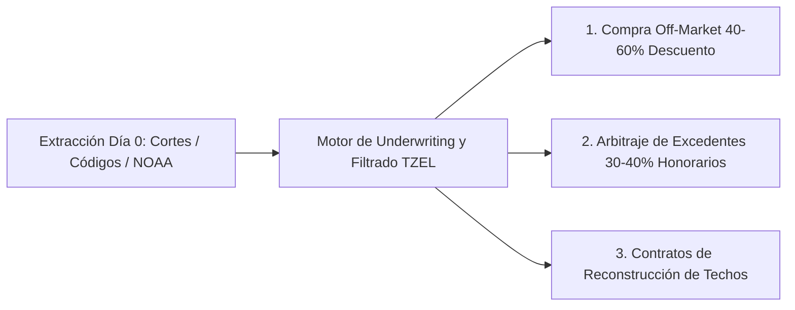
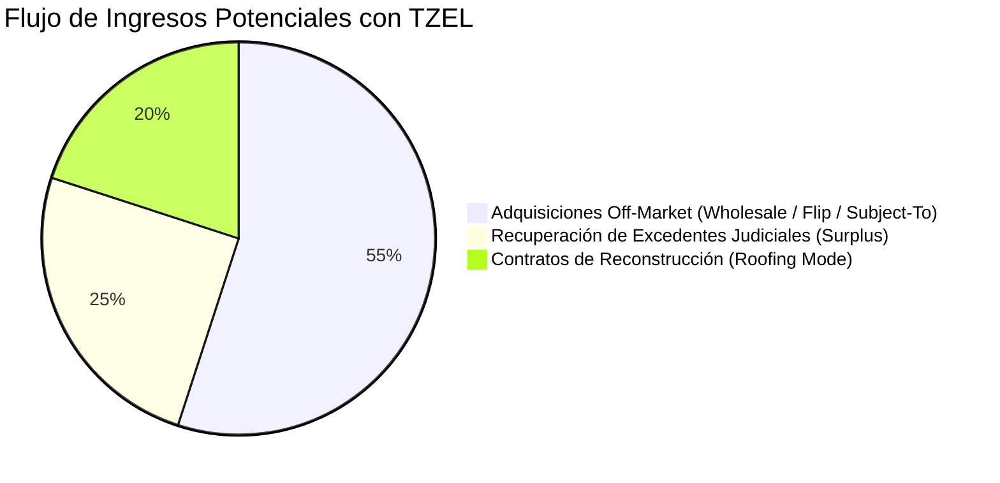
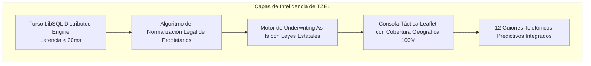

# 🏛️ TZEL: Executive Investment Memorandum
## *PropTech & Tactical Distressed Asset Intelligence Platform*

---

## 📌 1. Executive Summary (Resumen Ejecutivo)

En el mercado inmobiliario de Estados Unidos, **el 95% de los inversionistas compite por el mismo 5% de propiedades públicas** listadas en el MLS o en portales masivos como *Auction.com* y *Zillow*. Esta competencia feroz erosiona los márgenes de ganancia y obliga a pagar entre el 85% y 95% del valor de mercado.

Por otro lado, las herramientas tradicionales de datos (*PropStream, BatchLeads*) sufren de una **latencia crítica de 15 a 45 días**, comprando información a grandes agregadores de títulos cuando la oportunidad ya es de dominio público.

**TZEL resuelve este problema mediante una ventaja asimétrica:** un sistema de inteligencia de datos de **Día 0** que extrae, audita y valoriza oportunidades de alta motivación directamente desde las cortes judiciales de condado, departamentos municipales de inspección y radares meteorológicos.

---

## 💥 2. La Oportunidad de Mercado y el "Moat" (Foso Defensivo)

| Criterio | El Mercado Tradicional | **Con TZEL** |
| :--- | :--- | :--- |
| **Tiempo de Detección** | **15 a 45 días** después de radicada la demanda. | **Día 0 (Tiempo Real)** al publicarse en la corte local. |
| **Público Competidor** | Cientos de postores en subastas públicas (*Auction.com*). | **Trato 1-a-1 y privado** directamente con el propietario. |
| **Costos Recurrentes en Software** | > **$800 USD / mes** en 4 plataformas desconectadas. | **Infraestructura propietaria ($0 recurrente)**. |
| **Underwriting Financiero** | Cálculo manual y lento en hojas de Excel. | **MPO, Deuda Total y Equidad calculados en milisegundos**. |
| **Tasa de Descuento de Compra** | 5% - 15% por debajo del mercado. | **40% - 60% por debajo del valor de mercado (As-Is)**. |

---

## ⚙️ 3. Los Tres Motores de Monetización de TZEL

### 🎯 Canal A: Adquisición Inmobiliaria Distressed & Pre-Foreclosure
* **Tesis de Inversión:** Detectar propietarios antes de que pierdan su propiedad en subasta judicial.
* **Estrategias Aplicables:**
  * **Wholesale Inmobiliario:** Asignación rápida de contrato ganando entre **$15,000 y $35,000 USD** por operación sin usar capital propio.
  * **Subject-To / Novation:** Asumir la hipoteca existente a tasas de interés favorables del 3%-4% y capturar el diferencial de equidad (**$40,000 a $80,000+ USD**).
  * **Fix & Flip:** Comprar con 50% de descuento basado en el cálculo automatizado de la *Oferta Máxima Permisible (MPO)*.

### 💰 Canal B: Arbitraje de Fondos de Excedente (Surplus Funds Vault)
* **Tesis de Inversión:** Cero riesgo de capital y retorno inmediato.
* **Mecánica:** Cuando una casa se subasta y la puja supera la deuda del banco (`Winning Bid > Judgment Amount`), la corte retiene el dinero restante.
* **Monetización:** TZEL detecta el fondo retenido, ubica al ex-propietario despojado con Skip Trace y genera el contrato legal para reclamar el dinero a cambio de una **comisión de éxito del 30% al 40%**.
  * *Ticket promedio recuperable:* **$25,000 - $70,000 USD**.
  * *Honorario neto para el inversionista:* **$8,000 - $25,000 USD por caso resuelto**.

### 🌪️ Canal C: Inteligencia de Desastres y Reparación (Roofing Mode)
* **Tesis de Inversión:** Monetización inmediata en eventos de fuerza mayor.
* **Mecánica:** TZEL cruza los mapas de impacto de tornados (Escala EF-0 a EF-5) y granizo severo de la NOAA con propietarios ausentes e infracciones de techo.
* **Monetización:** Captación de contratos de reconstrucción integral cubiertos por el seguro del propietario en las primeras **48 a 72 horas** posteriores a la tormenta.

---

## 🧠 4. Tecnología Propietaria y Arquitectura

1. **Normalizador Legal Procesal (`cleanLegalOwnerName`):**
   * Transforma expedientes judiciales crudos (*"UNKNOWN HEIRS OF HERBERT GIBBS"*) en nombres tácticos de personas físicas (*"HERBERT GIBBS - Sucesión"*).
2. **Motor de Underwriting Regulatorio:**
   * Aplica automáticamente las reglas de subasta del estado (ejemplo: **66% del valor tasado por ley en Kentucky** / **70-75% en Indiana**), deduciendo gravámenes ocultos y multas de habitabilidad.
3. **Centro de Cierre con Skip Tracing en 1 Clic:**
   * Sin necesidad de pagar suscripciones externas, el operador tiene enlaces integrados a bases públicas en tiempo real (**FastPeopleSearch, TruePeopleSearch, Whitepages**) para marcar al propietario en segundos.

---

## 📈 5. Economía Unitaria (Unit Economics) de una Operación Tipo con TZEL

Ejemplo real extraído de la base auditada de TZEL (**Propiedad en Louisville / Jefferson County**):

| Métrica Financiera | Valor en Sistema |
| :--- | :---: |
| **Valor de Mercado Catastral (PVA)** | **$240,000 USD** |
| **Deuda Judicial Total Reclamada por el Banco** | **$115,000 USD** |
| **Margen Bruto de Equidad Teórica** | **+$125,000 USD** |
| **Oferta Máxima Sugerida por TZEL (MPO As-Is @ 66%)** | **$43,400 USD** |
| **Ganancia Neta Estimada (Wholesale o Flip)** | **$30,000 - $55,000 USD** |

---

## 🚀 6. Conclusión y Visión de Escalamiento

**TZEL convierte la información pública desordenada en un flujo predecible y automatizado de negocios inmobiliarios de alto rendimiento.**

Con una arquitectura ligera, escalable a cualquier condado de Estados Unidos y con **tres fuentes simultáneas de monetización**, TZEL representa una herramienta de generación de capital y alfa asimétrico superior a cualquier software comercial de suscripción en el mercado.
