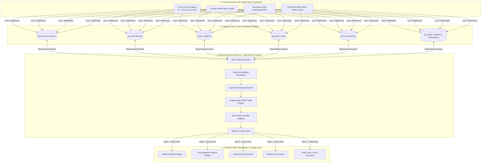
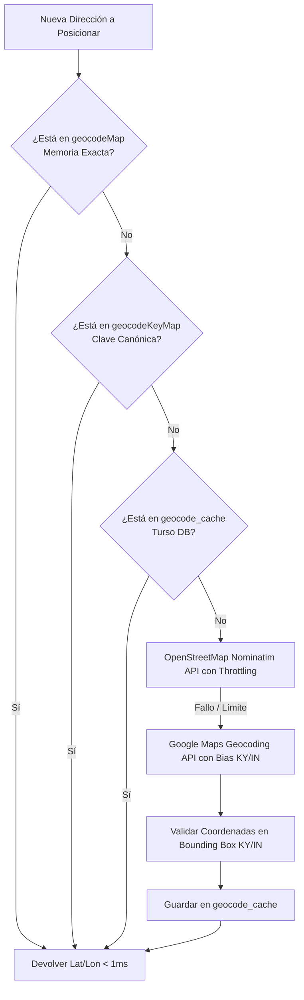

# 🛠️ TZEL: Especificación Técnica y Arquitectura de Software
## *Technical Architecture & Engineering Specification Document*

---

## 🏗️ 1. Diagrama de Arquitectura del Sistema

TZEL está construido bajo una arquitectura cliente-servidor desacoplada de alto rendimiento, diseñada para latencias de consulta inferiores a **20 ms** y cero consumo innecesario de APIs externas mediante caché distribuida.



---

## 🗄️ 2. Modelo de Datos y Esquema Relacional (Turso DB / SQLite)

La base de datos utiliza tablas normalizadas conectadas a través de claves canónicas (`address_key` / `groupingKey`):

```sql
-- 1. Subastas de Ejecución Judicial (Sheriff Sales)
CREATE TABLE IF NOT EXISTS foreclosure_auctions (
    auction_id TEXT PRIMARY KEY,
    case_number TEXT NOT NULL,
    address TEXT NOT NULL,
    county TEXT NOT NULL,
    state TEXT NOT NULL,
    plaintiff TEXT,
    defendant TEXT,
    debt_amount REAL DEFAULT 0,
    appraisal_value REAL DEFAULT 0,
    auction_date TEXT,
    needs_manual_review INTEGER DEFAULT 0,
    title_check_status TEXT DEFAULT 'pending',
    pdf_url TEXT,
    defendant_phones TEXT,
    defendant_emails TEXT,
    mailing_address TEXT,
    absentee_owner INTEGER DEFAULT 0,
    photo_urls TEXT
);

-- 2. Pre-Foreclosures (Demandas de Corte / Lis Pendens - Día 0)
CREATE TABLE IF NOT EXISTS pre_foreclosures (
    pre_foreclosure_id TEXT PRIMARY KEY,
    case_number TEXT NOT NULL,
    address TEXT NOT NULL,
    county TEXT NOT NULL,
    state TEXT NOT NULL,
    filing_date TEXT,
    plaintiff TEXT,
    defendant TEXT,
    case_status TEXT DEFAULT 'Active',
    days_since_filing INTEGER DEFAULT 0,
    defendant_phones TEXT,
    defendant_emails TEXT,
    mailing_address TEXT,
    absentee_owner INTEGER DEFAULT 0,
    photo_urls TEXT
);

-- 3. Infracciones Municipales de Código Urbano
CREATE TABLE IF NOT EXISTS code_violations (
    violation_id TEXT PRIMARY KEY,
    case_number TEXT NOT NULL,
    address TEXT NOT NULL,
    violation_type TEXT NOT NULL,
    status TEXT DEFAULT 'Active',
    report_date TEXT,
    sqft REAL,
    beds INTEGER,
    baths REAL,
    hidden_mortgages REAL DEFAULT 0,
    hidden_liens_amount REAL DEFAULT 0,
    defendant_phones TEXT,
    defendant_emails TEXT,
    mailing_address TEXT,
    absentee_owner INTEGER DEFAULT 0,
    photo_urls TEXT
);

-- 4. Caché de Geocodificación Espacial de Alta Velocidad
CREATE TABLE IF NOT EXISTS geocode_cache (
    address TEXT PRIMARY KEY,
    lat REAL,
    lon REAL,
    created_at DATETIME DEFAULT CURRENT_TIMESTAMP
);

-- 5. Enriquecimiento OSINT & Desemascaramiento de LLCs
CREATE TABLE IF NOT EXISTS osint_enrichment (
    address_key TEXT PRIMARY KEY,
    llc_directors TEXT,     -- JSON Array de personas físicas
    corporate_address TEXT,
    social_profiles TEXT,   -- JSON Array [{platform, url, dm_url}]
    usernames_found TEXT,
    env_stressors TEXT,
    env_attractors TEXT
);
```

---

## 🧠 3. Algoritmos y Motores de Cálculo Principales

### A. Normalizador de Clave Canónica de Dirección (`getGroupingKey`)
Evita la duplicación de registros provenientes de distintas fuentes oficiales (ej. *"123 Main St."* vs *"123 MAIN STREET"* vs *"123 Main St, Apt 4"*):

```typescript
function getGroupingKey(address: string): string {
  if (!address) return "";
  return address
    .toLowerCase()
    .replace(/,/g, " ")
    .replace(/\./g, "")
    .replace(/\b(street|st)\b/g, "st")
    .replace(/\b(avenue|ave)\b/g, "ave")
    .replace(/\b(road|rd)\b/g, "rd")
    .replace(/\b(boulevard|blvd)\b/g, "blvd")
    .replace(/\b(drive|dr)\b/g, "dr")
    .replace(/\b(lane|ln)\b/g, "ln")
    .replace(/\b(circle|cir)\b/g, "cir")
    .replace(/\b(court|ct)\b/g, "ct")
    .replace(/\b(highway|hwy)\b/g, "hwy")
    .replace(/\b(north|n)\b/g, "n")
    .replace(/\b(south|s)\b/g, "s")
    .replace(/\b(east|e)\b/g, "e")
    .replace(/\b(west|w)\b/g, "w")
    .replace(/\s+(apt|unit|suite|ste|#)\s*[\w\d-]+/g, "")
    .replace(/\s+/g, " ")
    .trim();
}
```

---

### B. Motor NLP de Resolución de Nombres Procesales (`cleanLegalOwnerName`)
Limpia la jerga procesal de los expedientes judiciales para extraer a la persona física y tipificar el caso:

$$\text{Expediente Crudo} \xrightarrow{\text{Regex Pipeline}} \text{Nombre Limpio} + \text{Rol Táctico (Heirs/Spouse/Executor)}$$

```typescript
function cleanLegalOwnerName(raw: string): string {
  let name = raw.trim();
  // 1. Detección de Herederos y Sucesiones (Probate)
  if (/UNKNOWN\s+(HEIRS|DEVISEES|LEGATEES|BENEFICIARIES)\s+(?:AND\s+DEVISEES\s+)?OF\s+([^,]+)/i.test(name)) {
    const match = name.match(/UNKNOWN\s+(?:HEIRS|DEVISEES|LEGATEES|BENEFICIARIES)\s+(?:AND\s+DEVISEES\s+)?OF\s+([^,]+)/i);
    if (match) return `${match[1].trim()} (Sucesión / Heirs)`;
  }
  // 2. Detección de Cónyuges
  if (/UNKNOWN\s+SPOUSE\s*(?:,\s*IF\s+ANY\s*,)?\s*OF\s+([^,]+)/i.test(name)) {
    const match = name.match(/UNKNOWN\s+SPOUSE\s*(?:,\s*IF\s+ANY\s*,)?\s*OF\s+([^,]+)/i);
    if (match) return `${match[1].trim()} (Cónyuge / Titular)`;
  }
  // 3. Ejecutores y Administradores de Herencias
  if (/(?:ADMINISTRATOR|EXECUTOR|EXECUTRIX)\s+OF\s+THE\s+ESTATE\s+OF\s+([^,]+)/i.test(name)) {
    const match = name.match(/(?:ADMINISTRATOR|EXECUTOR|EXECUTRIX)\s+OF\s+THE\s+ESTATE\s+OF\s+([^,]+)/i);
    if (match) return `${match[1].trim()} (Sucesión / Heirs)`;
  }
  // Limpieza de sufijos procesales
  return name.replace(/,\s*ET\s+AL\.?/gi, "").trim();
}
```

---

### C. Cascada de Geocodificación Multinivel Resiliente
Garantiza **100.0% de cobertura espacial** sin timeouts de API:



---

### D. Motor de Underwriting y Cálculo de MPO (Oferta Máxima Permisible)

El sistema aplica leyes regulatorias locales para modelar la oferta de compra más agresiva y rentable:

$$MPO_{\text{As-Is}} = \max\left(0, (\text{MarketValue} \times \text{DiscountFactor}) - \text{TotalDebt} - \text{RehabEst}\right)$$

$$\text{DiscountFactor} = \begin{cases} 
0.66 & \text{si State} = \text{'KY' (Estatuto Judicial KRS 426.520: 2/3 Tasación)} \\
0.70 & \text{si High Motivation / Stacking} \\
0.75 & \text{si State} = \text{'IN' / Estándar}
\end{cases}$$

$$\text{TotalConsolidatedDebt} = \text{PrimaryJudgmentDebt} + \text{HiddenMortgages} + \text{HiddenLiens}$$

$$\text{EquitySpread} = \text{MarketValue} - \text{TotalConsolidatedDebt}$$

---

## 📡 4. Especificación de Endpoints REST

### `GET /api/prospectos`
* **Descripción:** Devuelve la lista unificada y consolidada de todos los prospectos activos (*Auctions*, *Pre-Foreclosures*, *Violations*, *Probates*, etc.).
* **Tiempo de Respuesta:** `< 15ms` (Caché en memoria de servidor) / `< 450ms` (Cold Start desde Turso DB con lote de 12 consultas SQL simultáneas).
* **Parámetros de Retorno:**
  ```json
  {
    "status": "success",
    "count": 558,
    "data": [
      {
        "groupingKey": "808 poplar st jeffersonville in",
        "displayAddress": "808 Poplar Street, Jeffersonville, IN 47130",
        "state": "IN",
        "county": "Clark",
        "ownerName": "NANCY WHITE",
        "lat": 38.2831,
        "lon": -85.7412,
        "mlsValue": 220000,
        "primaryDebt": 145900,
        "hiddenMortgages": 135000,
        "hiddenLiensAmount": 0,
        "auctions": [{ "case_number": "10C01-2401-MF-000012", "plaintiff": "FIFTH THIRD BANK", "debt_amount": 145900, "auction_date": "10/14/2026" }],
        "preForeclosures": [],
        "phones": ["(812) 555-0142", "(812) 555-0199"],
        "emails": ["nwhite@example.com"],
        "isAbsentee": false,
        "isHighMotivation": true
      }
    ]
  }
  ```

### `GET /api/surplus`
* **Descripción:** Consulta los remates judiciales finalizados con fondos en custodia de la corte.
* **Cálculo:** `surplus_amount = winning_bid - judgment_amount`.

---

## 💻 5. Arquitectura del Frontend y Reactividad

* **Cero Framework Overhead:** Desarrollado en JavaScript Vanilla ES6+ nativo, minimizando el bundle a menos de **300 KB** (carga inicial instantánea).
* **Sincronización de Estado Bidireccional:**
  1. **Map Viewport Bounds ➔ Carousel Inferior:** Al mover o hacer zoom en el mapa, el carrusel inferior y el contador se recalculan con `map.getBounds().contains(latLng)`.
  2. **Cronograma Lateral ➔ Ficha Técnica:** Al hacer clic en cualquier subasta del cronograma, la Ficha Técnica se superpone en `z-index: 1000` preservando el estado de la lista base.
  3. **Skip Trace en 1 Clic:** Inyección dinámica de queries URI codificadas hacia `FastPeopleSearch`, `TruePeopleSearch` y `Whitepages` sin necesidad de llamadas de pago a APIs externas.
